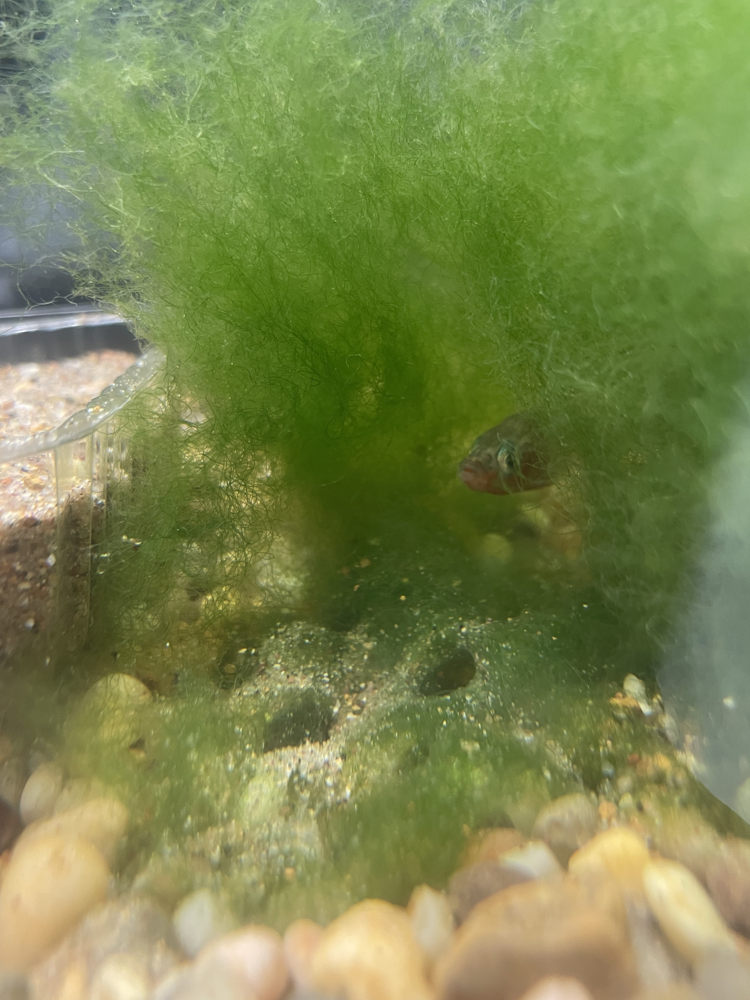
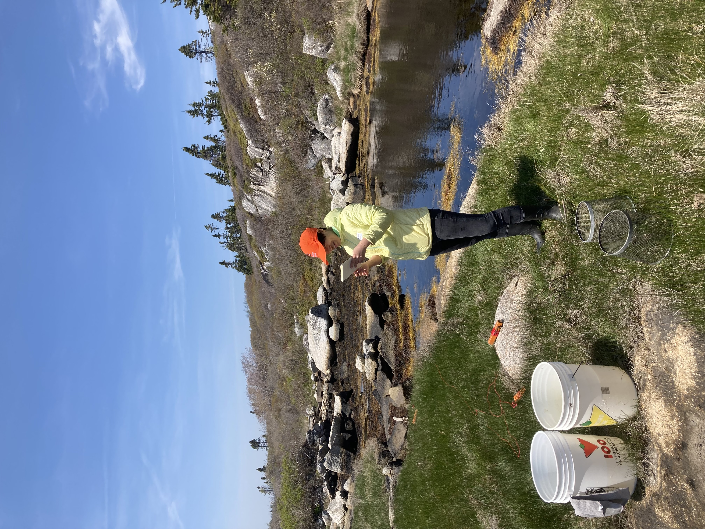

I am broadly interested in the neurobiology and evolution of behaviour, particularly social behaviour. Currently, I study the reproductive behaviour of threespine stickleback fish (_Gasterosteus aculeatus_) and the evolution thereof. I would love to continue working on non-traditional model organisms (critters!), but I also have 5 years experience working with lab mice. 

### Current Projects

"A threespine stickleback at his nest"  
{width="25%"}
My current research investigates the divergence of two ecotypes of threespine stickleback found in Nova Scotia, Canada. The "common" ecotype displays the male uniparental care typical of the species, but the "white" ecotype, so named because of their white breeding colouration, has lost care behaviour. Instead, the male whites spit their embryos out of the nest in what we call "dispersal" behaviour. Leveraging this "natural experiment", my dissertation aims to answer the following questions:

#### How does oxytocin influence courtship and parenting in commons and whites?

__Skills:__ Behavioural scoring w/ Jwatcher, IP injections, Brain dissections, Cryostat sectioning, Immunohistochemistry, Microscope imaging   

#### How do the brains of commons and whites differ as they transition into their respective post-spawn behaviours (parental care, dispersal)?  
#### Are the differences in cell type abundance, neural activity, gene expression, and/or spatial organisation? 

__Skills:__ Nuclei extraction, DNA extraction, Bash scripting, Analysis of single-nuclei RNAseq data in R, Analysis of spatial transcriptomic data in R  

#### Do differences in olfactory perception of embryos cues play a role in the divergence between commons and whites?

__Skills:__ Behavioural scoring w/ Jwatcher, Anesthetization of fish, Brain dissections, Cryostat sectioning, Immunohistochemistry, Microscope imaging  

### Side Projects

#### Building an anatomical and molecular brain atlas for threespine stickleback

A long-term side project that I have been working on in collaboration with Dr. Tina Barbasch, Meghan Maciejewski, Julia Ciura (undergrad), and Catherine Marquez (undergrad) is to create a brain atlas for threespine stickleback. A brain atlas would be instrumental in applying other molecular tools, such as viral-mediated transgenesis, to our study system.  

### Fieldwork

"Neuroscientist in the wild!"  
{width="25%"} 
I have had the rare privilege (for a neuroscientist) of going out into the field and seeing my model organism in the wild. In summer 2023 and 2024, I went to Nova Scotia, Canada to trap wild stickleback and generate embryos to bring back to the lab.  

__Skills:__ Trapping w/ minnow traps, Shipping live fish embryos internationally, Shipping frozen samples internationally

